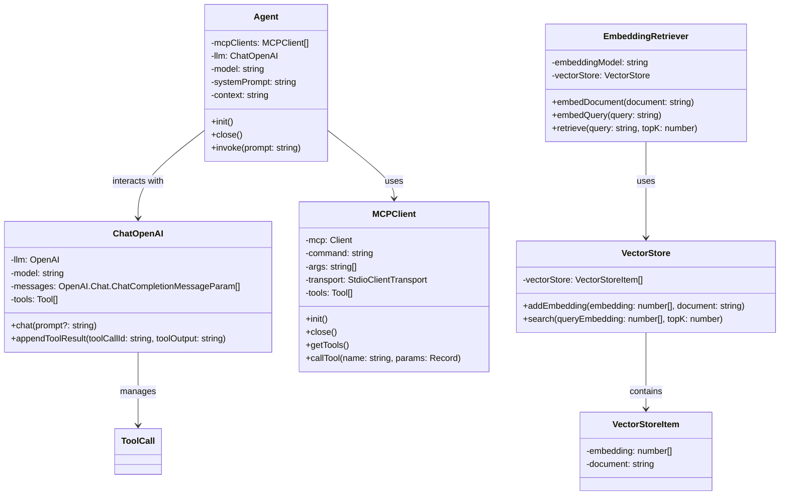

# LLM + MCP

## 目标

- **Augmented LLM** (Chat + MCP)
- 不依赖框架
    - LangChain, LlamaIndex, CrewAI, AutoGen
- **MCP**
    - 支持配置多个MCP Serves
- **任务**
   - 阅读网页 → 整理一份总结 → 保存到文件

## **The augmented LLM**

- [Building Effective Agents](https://www.anthropic.com/engineering/building-effective-agents)




## **依赖**

```bash
git clone git@github.com:KelvinQiu802/ts-node-esm-template.git
pnpm install
pnpm add dotenv openai @modelcontextprotocol/sdk chalk**
```

## LLM

- [OpenAI API](https://platform.openai.com/docs/api-reference/chat)

## MCP

- [MCP 架构](https://modelcontextprotocol.io/docs/concepts/architecture)
- [MCP Client](https://modelcontextprotocol.io/quickstart/client)
- [Fetch MCP](https://github.com/modelcontextprotocol/servers/tree/main/src/fetch)
- [Filesystem MCP](https://github.com/modelcontextprotocol/servers/tree/main/src/filesystem)
